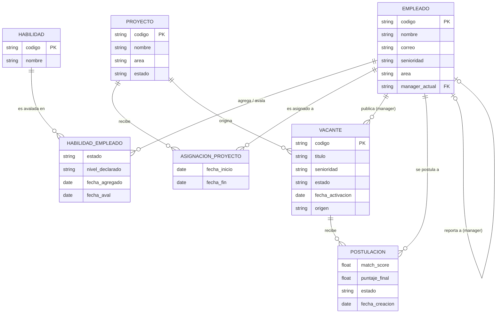
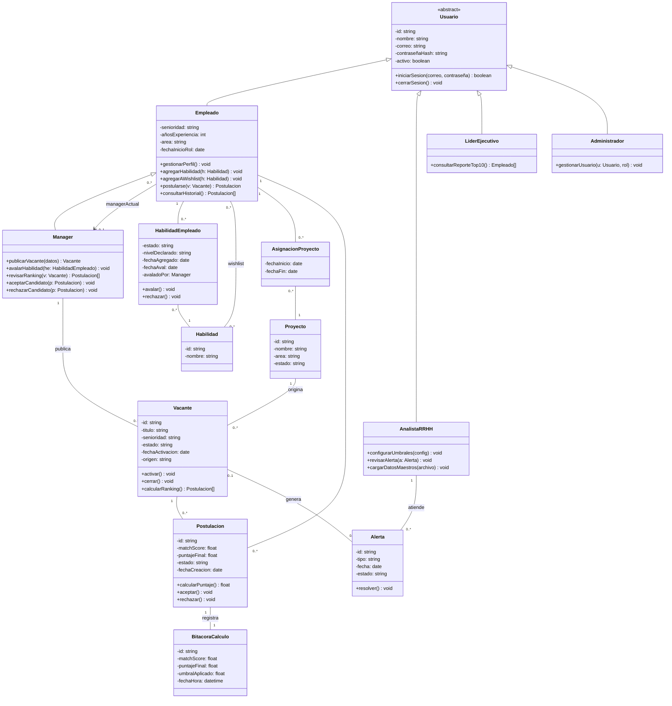

# TalentMatch — Diagrama de Clases

| Campo | Valor |
|---|---|
| **Documento** | Diagrama de Clases (DC) |
| **Versión** | 1.0 |
| **Fecha** | 2026-09-21 |
| **Tecnología** | [Mermaid](https://mermaid.js.org/) — diagrama como código, versionado junto al repositorio y renderizado nativamente por GitHub/GitLab en cualquier archivo `.md`, sin depender de una herramienta gráfica propietaria ni de una imagen exportada que se desactualice. |
| **Documentos fuente** | [Reglas de Negocio](../reglas-negocio/RN-TalentMatch-Reglas-de-Negocio.md) · [Requerimientos](../requerimientos/RF-RNF-TalentMatch.md) · [Casos de Uso](../casos-uso/CU-TalentMatch.md) · [Base de datos](../../database/README.md) |

Este documento presenta el modelo de clases de TalentMatch en **dos notaciones complementarias**,
tal como se usan en la industria:

1. **[Modelo Entidad-Relación](#1-modelo-entidad-relación-notación-pata-de-cuervo)** — la vista
   conceptual de los datos, pensada para el diseño de la base de datos.
2. **[Diagrama de Clases UML](#2-diagrama-de-clases-uml)** — la vista de diseño orientada a
   objetos, con atributos, métodos, visibilidad, herencia y multiplicidad.

> **Nota de notación.** El modelo E-R usa notación **Pata de Cuervo / Information Engineering**
> (cajas con atributos y líneas con cardinalidad en los extremos) en vez de la notación de Chen
> (rombos + óvalos). Pata de Cuervo es el estándar que usan las herramientas profesionales de
> modelado de datos (MySQL Workbench, dbdiagram.io, draw.io, etc.) y es el que mejor traduce
> directamente a las tablas de [`database/`](../../database/README.md). Las relaciones N:M con
> atributos propios (avalar una habilidad, postularse a una vacante) se resuelven como **entidades
> asociativas**, que es exactamente como se implementan como tablas intermedias en la base de
> datos relacional.

---

## 1. Modelo Entidad-Relación (notación Pata de Cuervo)

Vista conceptual del núcleo del dominio: habilidades, empleados, proyectos, vacantes y
postulaciones.

### Lectura de cardinalidades

| Relación | Cardinalidad | Regla de negocio |
|---|---|---|
| Empleado — Habilidad (vía `HABILIDAD_EMPLEADO`) | N:M, con estado `agregado`/`avalado` | RN-19, RN-20 |
| Empleado — Proyecto (vía `ASIGNACION_PROYECTO`) | 1:N por empleado a lo largo del tiempo | RN-02 |
| Proyecto — Vacante | 1:N | RN-02 |
| Empleado (manager) — Vacante | 1:N (quien publica) | RF-11 |
| Empleado — Vacante (vía `POSTULACION`) | N:M, con Match Score y Puntaje Final | RN-06…RN-13 |
| Empleado — Empleado | 0..1:N (un manager gestiona a varios empleados) | RN-19 |

---

## 2. Diagrama de Clases UML

Vista de diseño orientada a objetos: roles del sistema (herencia desde `Usuario`), métodos por
clase y multiplicidad UML (`0..1`, `1`, `0..*`) en cada extremo de asociación.

### Notas de diseño

- **`Manager` hereda de `Empleado`**, no es un rol aparte: en TalentMatch todo manager es también
  un empleado que puede rotar y postularse (RN-11), y además publica vacantes y avala habilidades
  de su equipo.
- **`HabilidadEmpleado`, `AsignacionProyecto` y `Postulacion`** son *clases asociativas*: existen
  porque la relación N:M entre sus dos clases tiene atributos propios (estado, fechas, puntajes).
  Son las mismas tres tablas intermedias del modelo E-R.
- **`BitacoraCalculo`** queda deliberadamente sin métodos de escritura pública: es de solo
  lectura, tal como exige RNF-06.
- No existen clases `MetaCarrera` / `EscaleraCarrera` ni el rol `VP Engineering`: se eliminaron
  del alcance del MVP (PEN-03, ver [Reglas de Negocio §9](../reglas-negocio/RN-TalentMatch-Reglas-de-Negocio.md#9-confirmaciones-con-la-empresa)).

---

## 3. Trazabilidad

| Clase / Entidad | Origina en |
|---|---|
| `Usuario`, `Administrador` | RF-01…RF-03, CU_01…CU_02, CU_23 |
| `Empleado`, `HabilidadEmpleado`, `Habilidad` | RN-19, RN-20 · RF-04, RF-06…RF-08 · CU_03, CU_05, CU_06 |
| `Manager` | RF-11 · CU_09, CU_14, CU_15, CU_16 |
| `Proyecto`, `AsignacionProyecto`, `Vacante` | RN-01…RN-05 · RF-11, RF-12, RF-14 · CU_09, CU_18, CU_19 |
| `Postulacion`, `BitacoraCalculo` | RN-06…RN-18, RN-25 · RF-15…RF-27 · CU_11, CU_12, CU_14…CU_17 |
| `AnalistaRRHH`, `Alerta` | RN-29, RN-30 · RF-32, RF-33 · CU_19, CU_24, CU_25 |
| `LiderEjecutivo` | RN-21, RN-22 · RF-28, RF-29 · CU_22 |
